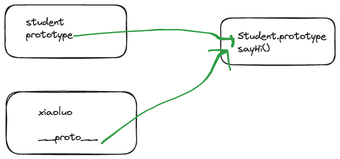

> 如何准确判断一个变量是不是数组
> class 原型本质,怎么理解


### class 和继承
-  constructor 
-  属性
- 方法
>  instanceof  用来判断是否是一个class 对象创建出来的
```js
class A {}
class B extends A {}
const c = new B()
c instanceof A //true
c instanceof B //true
c instanceof Object //true

```

#### 继承
- extends 
- 子类调用父类构造方法,需要用super()

### 类型判断和 instanceof 
- instanceof 本质上是去这个实例上是否有这个对象的prototype ,有就是true ,没有就是false 

### 原型和原型链
- class 创建出来的对象 typeof 是函数
-  __proto__ 隐式原型
- Class.prototype 显示原型



> 每个对象都有显示原型,每个实例都有隐式原型,他们指向的都是同一个内存地址
> 获取属性或者执行方法的查找顺序
> 1. 先在自身属性和方法中寻找
> 2. 如果找不到,则自动去__proto__中查找


怎么验证?
- 实例对象. hasOwnProperty()


### 作用域和闭包
1. 全局作用域
2. 函数作用域
3. 块级作用域
自由变量
- 一个变量在当前作用域中没有被定义,但是被使用了
- 闭包的表现
	- 函数作为参数被传递
	- 函数作为返回值被返回
	- 函数中的自由变量的寻找方式是**根据函数定义的作用域**来寻找的,不是在执行的地方
```js
// 一种情况,函数作为参数
function print(fn){

let a = 200

fn()

}
 

let a = 100

function fn (){

console.log(a);

}

  

print(fn)// 100 , 它只会在函数定义的地方开始向上一级查找自由变量,如果找不到,就会报错


//另一种情况,函数作为返回值
function create(){

let b =300

return function(){

console.log(b);

}

}

b =400

let c= create()

c() // 300
```
####  this 的不同应用场景,如何取值
- 作为普通函数
- 使用call bind apply 
	- bind 是会返回一个新的函数,执行新的函数
- 作为对象方法被调用
	- 特殊情况
	- 如果是setTimeout(),里面是function ()那么this就是window
	- 如果是箭头函数,那么this就需要看它上一层作用域
- 在class 方法中调用
- 箭头函数
> this 的 取值 ,确定是在**函数执行**的时候确定的,不是函数定义的时候确定的
#### 手写bind 
#### 实际开发中闭包的应用场景
- 隐藏数据
```js
// 隐藏数据

function createCache(){

let cache = {}

return {

get(key){

return cache[key]

},

set(key,value){

cache[key] = value

}

}

}

// 这种情况,我们是无法访问cache的,这样就完成了数据的隐藏

const c = createCache()

c.set('a',100)

console.log(c.get('a'))
```
