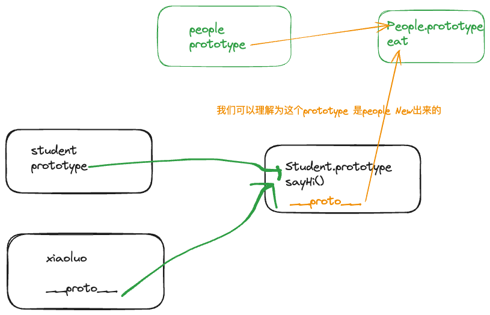

> 如何准确判断一个变量是不是数组
> class 原型本质,怎么理解


### class 和继承
-  constructor 
-  属性
- 方法
>  instanceof  用来判断是否是一个class 对象创建出来的
```js
class A {}
class B extends A {}
const c = new B()
c instanceof A //true
c instanceof B //true
c instanceof Object //true

```

#### 继承
- extends 
- 子类调用父类构造方法,需要用super()

### 类型判断和 instanceof 
- instanceof 本质上是去这个实例上是否有这个对象的prototype ,有就是true ,没有就是false 

### 原型和原型链
- class 创建出来的对象 typeof 是函数
-  __proto__ 隐式原型
- Class.prototype 显示原型


> 每个对象都有显示原型,每个实例都有隐式原型,他们指向的都是同一个内存地址
> 获取属性或者执行方法的查找顺序
> 1. 先在自身属性和方法中寻找
> 2. 如果找不到,则自动去__proto__中查找



怎么验证?
- 实例对象. hasOwnProperty()