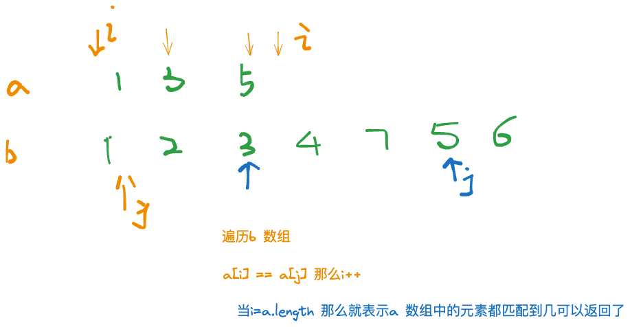

给定一个长度为 n 的整数序列 a1,a2,…,an 以及一个长度为 m的整数序列 b1,b2,…,bm。

请你判断 a 序列是否为 b 序列的子序列。

子序列指序列的一部分项按**原有次序排列**而得的序列，例如序列 {a1,a3,a5}是序列 {a1,a2,a3,a4,a5} 的一个子序列。

#### 输入格式

第一行包含两个整数 n,m。

第二行包含 n 个整数，表示 a1,a2,…,an。

第三行包含 m 个整数，表示 b1,b2,…,bm。

#### 输出格式

如果 a 序列是 b 序列的子序列，输出一行 `Yes`。

否则，输出 `No`。

#### 数据范围

1≤n≤m≤105,  
−109≤ai,bi≤109−109

#### 输入样例：

```
3 5
1 3 5
1 2 3 4 5
```

#### 输出样例：

```
Yes
```


```java
import java.io.*;
class Main{
    static final int N =100010;
    static final int M =100010;
    static int[] a = new int[N];
    static int[] b = new int[M];
    public static void main(String[] args) throws IOException{
        BufferedReader reader = new BufferedReader(new InputStreamReader(System.in));
        String[] str = reader.readLine().split(" ");
        String[] s1 = reader.readLine().split(" ");
        String[] s2 = reader.readLine().split(" ");
        int n = Integer.parseInt(str[0]);
        int m  = Integer.parseInt(str[1]);
        for(int i=0;i<n;i++) a[i] = Integer.parseInt(s1[i]);
        for(int i=0;i<m;i++) b[i] = Integer.parseInt(s2[i]);
        
        int i = 0;
        for(int j = 0;j<m;j++){
            if(i<n && a[i]==b[j])i++;
            if(i==n){
               System.out.print("Yes");
               return;
            }
        }
        System.out.print("No");
    }
}
```