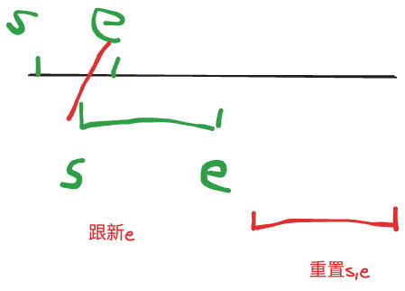

给定 n 个区间 [li,ri][��,��]，要求合并所有有交集的区间。

注意如果在端点处相交，也算有交集。

输出合并完成后的区间个数。

例如：[1,3][1,3] 和 [2,6][2,6] 可以合并为一个区间 [1,6][1,6]。

#### 输入格式

第一行包含整数 n。

接下来 n 行，每行包含两个整数 l 和 r。

#### 输出格式

共一行，包含一个整数，表示合并区间完成后的区间个数。

#### 数据范围

1≤n≤100000,  
−109≤li≤ri≤109

#### 输入样例：

```
5
1 2
2 4
5 6
7 8
7 9
```

#### 输出样例：

```
3
```



``` java

import java.io.*;
import java.util.*;
class Main{
    
    public static void main(String[] args){
        
        List<Interver> lists = new ArrayList<>();
        read(lists);
        Collections.sort(lists);
        int start = lists.get(0).s;
        int end = lists.get(0).s;
        int res = 0;
        for(Interver i:lists){
            // 如果重合,那么就跟新end
            if(i.s<=end) end = Math.max(end,i.e);
            else {
            // 不重合 跟新start 和end 
                start = i.s;
                end = i.e;
                res++;
            }
        }
        System.out.print(res+1); // 需要加上第一个区间
        
    }
    public static void read(List<Interver> ls){
        Scanner sc = new Scanner(System.in);
        int n = sc.nextInt();
        while(n-->0){
            int s = sc.nextInt();
            int e = sc.nextInt();
            ls.add(new Interver(s,e));
        }
    }
    
}

class Interver implements Comparable<Interver>{
    public int s,e;
    public Interver(int s,int e){
        this.s = s;
        this.e = e;
    }
    /**
       按照Interver 的s 来进行升序
         原来是 2 ,1   就会变成 1,7 
               1 ,7           2,1
    */
    public int compareTo(Interver i){
        return Integer.compare(s,i.s); // 比较之后是按照每组的s 来排序
        
    }
}
```