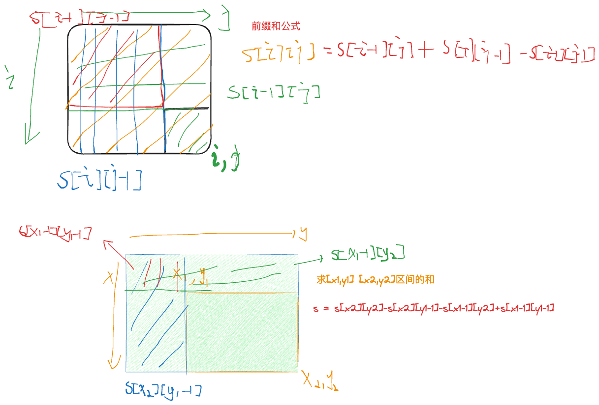

输入一个 n 行 m 列的整数矩阵，再输入 q� 个询问，每个询问包含四个整数 x1,y1,x2,y2，表示一个子矩阵的左上角坐标和右下角坐标。

对于每个询问输出子矩阵中所有数的和。

#### 输入格式

第一行包含三个整数 n，m，q。

接下来 n 行，每行包含 m 个整数，表示整数矩阵。

接下来 q 行，每行包含四个整数 x1,y1,x2,y2，表示一组询问。

#### 输出格式

共 q 行，每行输出一个询问的结果。

#### 数据范围

1≤n,m≤1000,  
1≤q≤200000,  
1≤x1≤x2≤n,  
1≤y1≤y2≤m,  
−1000≤矩阵内元素的值≤1000−1000≤矩阵内元素的值≤1000

#### 输入样例：

```
3 4 3
1 7 2 4
3 6 2 8
2 1 2 3
1 1 2 2
2 1 3 4
1 3 3 4
```

#### 输出样例：

```
17
27
21
```




```java 
import java.io.*;
class Main{
    public static void main(String[] args) throws IOException {
        BufferedReader reader = new BufferedReader(new InputStreamReader(System.in));
        String[] str= reader.readLine().split(" ");
        int i = Integer.parseInt(str[0]);
        int j = Integer.parseInt(str[1]);
        int q = Integer.parseInt(str[2]);
        int[][] arr = new int[i][j];
        for(int m=0;m< i;m++ ){
             String[] s =  reader.readLine().split(" ");
            for(int n = 0;n < j;n++){
                arr[m][n] = Integer.parseInt(s[n]);
            }
        }
        
        int[][] sum = new int[i+1][j+1];
           for(int m=1;m<= i;m++ ){
            for(int n = 1;n <= j;n++){// 先求前缀和
              
                sum[m][n]= sum[m-1][n]+sum[m][n-1]-sum[m-1][n-1]+arr[m-1][n-1];
                //   System.out.print(sum[m][n]+" ");
            }
            // System.out.println();
        }
        while(q-->0){
            String[] str1 = reader.readLine().split(" ");
            int x1= Integer.parseInt(str1[0]);
            int y1 = Integer.parseInt(str1[1]);
            int x2 = Integer.parseInt(str1[2]);
            int y2 = Integer.parseInt(str1[3]);
            int res = sum[x2][y2]-sum[x2][y1-1]-sum[x1-1][y2]+sum[x1-1][y1-1];
            System.out.println(res);
        }
        
        
    }
    
    
}
```