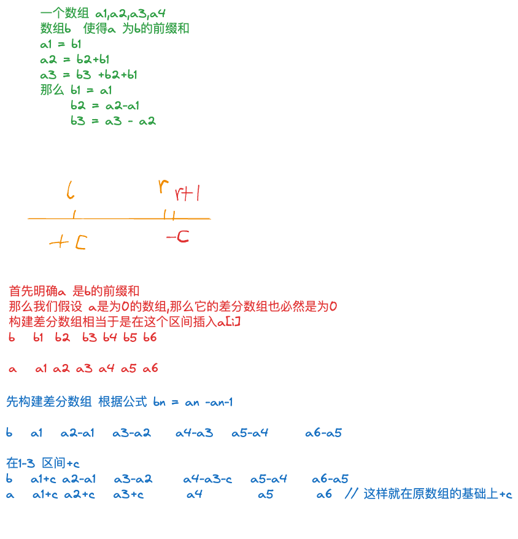

---
输入一个长度为 n 的整数序列。

接下来输入 m 个操作，每个操作包含三个整数 l,r,c，表示将序列中 [l,r] 之间的每个数加上 c。

请你输出进行完所有操作后的序列。

#### 输入格式

第一行包含两个整数 n 和 m。

第二行包含 n 个整数，表示整数序列。

接下来 m 行，每行包含三个整数 l，r，c，表示一个操作。

#### 输出格式

共一行，包含 n 个整数，表示最终序列。

#### 数据范围

1≤n,m≤100000,  
1≤l≤r≤n1,  
−1000≤c≤100,  
−1000≤整数序列中元素的值≤1000−1000≤整数序列中元素的值≤1000

#### 输入样例：

```
6 3
1 2 2 1 2 1
1 3 1
3 5 1
1 6 1
```

#### 输出样例：

```
3 4 5 3 4 2
```




```java

import java.io.*;
class Main{
    static int N = 100010;
    public static void main(String[] args) throws IOException{
        
        BufferedReader reader =new BufferedReader(new InputStreamReader(System.in));
        String[] str = reader.readLine().split(" ");
        int n = Integer.parseInt(str[0]);
        int q = Integer.parseInt(str[1]);
        String[] s = reader.readLine().split(" ");
        int[] arr = new int[N];
        int[] b = new int[N];
        for(int i = 1;i<=n;i++){
            arr[i] = Integer.parseInt(s[i-1]);
            insert(b,i,i,arr[i]); // 构建差分数组
         
        }
        
        
        while(q-->0){
            String[] s2 = reader.readLine().split(" ");
            int l = Integer.parseInt(s2[0]);
            int r = Integer.parseInt(s2[1]);
            int m = Integer.parseInt(s2[2]);
            insert(b,l,r,m);
        }
        
        
        //最后求一遍差分数组的前缀和
        for(int i = 1 ; i <= n ; i ++ ){
            b[i] += b[i - 1];
            System.out.print(b[i] + " ");
        }
    }
    // 构建查分数组
    static void insert(int[] arr,int l,int r, int n){
        arr[l] +=n;
        arr[r+1] -=n;
    }
}
```
