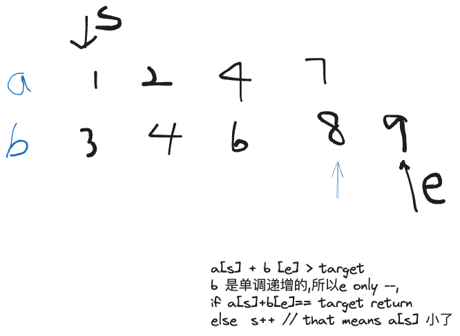

给定两个升序排序的有序数组 A 和 B，以及一个目标值 x。

数组下标从 00 开始。

请你求出满足 A[i]+B[j]=x 的数对 (i,j)。

数据保证有唯一解。

#### 输入格式

第一行包含三个整数 n,m,x，分别表示 A 的长度，B 的长度以及目标值 x。

第二行包含 n 个整数，表示数组 A。

第三行包含 m 个整数，表示数组 B。

#### 输出格式

共一行，包含两个整数 i 和 j。

#### 数据范围

数组长度不超过 105。  
同一数组内元素各不相同。  
1≤数组元素≤109

#### 输入样例：

```
4 5 6
1 2 4 7
3 4 6 8 9
```

#### 输出样例：

```
1 1
```

> 一般我们可以考虑暴力解法
> 但是这个如果是有单调性的话,那么我们就可以考虑用双指针来进行优化


```java 
import java.io.*;

class Main{
    static int N=100010;
    static int[] a=new int[N];
    static int[] b=new int[N];

    public static void main(String[] args) throws IOException{
        BufferedReader in = new BufferedReader(new InputStreamReader(System.in));
        String[] cur=in.readLine().split(" ");
        int n=Integer.parseInt(cur[0]);
        int m=Integer.parseInt(cur[1]);
        int target=Integer.parseInt(cur[2]);

        String[] A=in.readLine().split(" ");
        for(int i=0;i<n;i++) a[i]=Integer.parseInt(A[i]);
        String[] B=in.readLine().split(" ");
        for(int i=0;i<m;i++) b[i]=Integer.parseInt(B[i]);
        // 定义头尾指针
        for(int start =0,end = m-1;start<n;start++){
            while(end>=0&& a[start]+b[end] > target) end--;
            if(a[start]+b[end]==target) {
                System.out.print(start+" "+end);
                break;
            }
            
        }

}
    
    
}
```