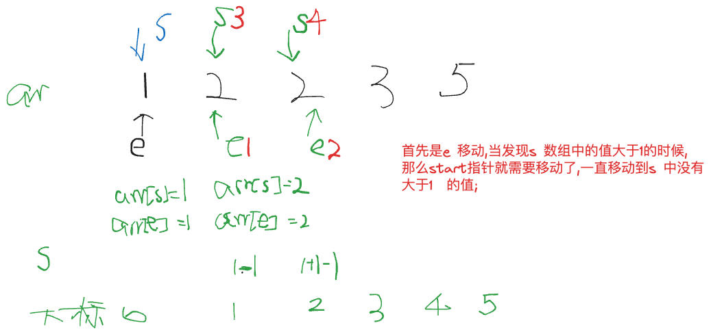

给定一个长度为 n 的整数序列，请找出最长的不包含重复的数的连续区间，输出它的长度。

#### 输入格式

第一行包含整数 n。

第二行包含 n 个整数（均在 0∼1050∼105 范围内），表示整数序列。

#### 输出格式

共一行，包含一个整数，表示最长的不包含重复的数的连续区间的长度。

#### 数据范围

1≤n≤10^5

#### 输入样例：

```
5
1 2 2 3 5
```

#### 输出样例：

```
3
```



```java

import java.io.*;

class Main{
    static final int N = 100010;
    static int[] arr = new int[N];
    static int[] s = new int[N];
    public static void main(String[] args ) throws IOException{
        BufferedReader reader = new BufferedReader(new InputStreamReader(System.in));
        int n = Integer.parseInt(reader.readLine());
        String[] strs = reader.readLine().split(" ");
        for(int i = 0;i<n;i++){
            arr[i] = Integer.parseInt(strs[i]);
            
        }
     
        int res = 0;
      
        for(int end =0,start=0;end<strs.length;end++){
            s[arr[end]]++;
            while(s[arr[end]]>1){
                s[arr[start]]--;
                start++;
            }
            res = Math.max(res,end-start+1);
        }
        
        System.out.print(res);
        
    }
}


```
